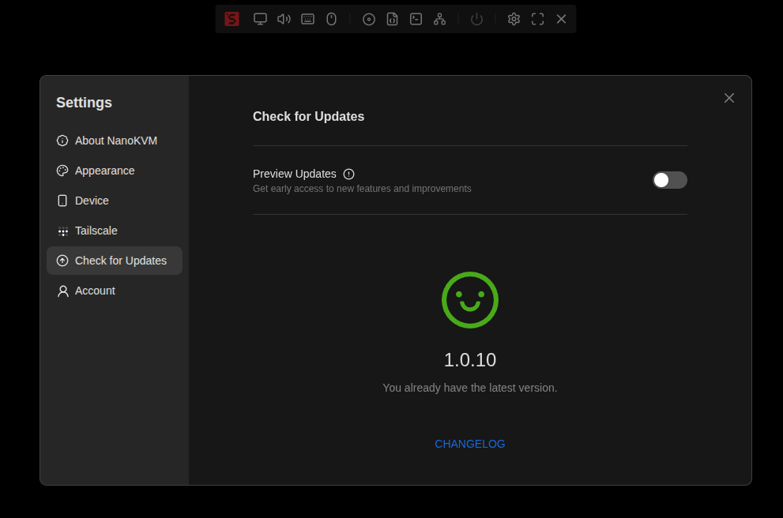

## Switching to PiKVM

In addition to running the NanoKVM framework, NanoKVM Pro is also compatible with the PiKVM software framework. You can switch between them as needed.

### Switching to PiKVM

By default, the NanoKVM Pro uses the NanoKVM framework. You can switch to PiKVM in `Settings` -> `About` -> `Switch Device`.


After clicking, the system will automatically restart and boot into the PiKVM framework. This process takes about 30 seconds. If it does not switch automatically for a long time, please refresh the webpage manually.


The default username and password for the PiKVM framework are also `admin`, `admin`. However, the two platforms use their own usernames and passwords, which are not unified. It is strongly recommended to change them after logging in.


> Some functions in the PiKVM framework require the use of a web terminal, such as Wi-Fi configuration and Tailscale setup.  
> When updating NanoKVM, the PiKVM framework will be updated simultaneously.

### Switching to NanoKVM

Switching back from the PiKVM system to NanoKVM is equally simple. Just go to `Options` -> `Switch to NanoKVM` and click `Switch Now`.


After clicking, the system will automatically restart and boot into the NanoKVM framework. This process takes about 30 seconds. If it does not switch automatically for a long time, please refresh the webpage manually.

## SSH

To ensure security, SSH is disabled by default on the NanoKVM Pro. If you need SSH access or want to preview a new version, you can enable SSH by going to `Settings` -> `Device`.

The default username is `root` and the password is `sipeed`. If you change the web account password under the NanoKVM framework, the SSH password will be updated accordingly.

## Updates

NanoKVM Pro will periodically push new application versions that include new features and bug fixes. You can update the application version in `Settings` -> `Check for Updates`.



After clicking download, the new application installation package will be automatically downloaded, which includes `kvmcomm_x.x.x_arm64.deb`, `nanokvmpro_x.x.x_arm64.deb`, and `pikvm_x.x.x_arm64.deb`:
+ `kvmcomm_x.x.x_arm64.deb` is responsible for driving the shared hardware in the NanoKVM and PiKVM frameworks;
+ `nanokvmpro_x.x.x_arm64.deb` is the NanoKVM application software;
+ `pikvm_x.x.x_arm64.deb` is the PiKVM application software.

Enabling the preview update feature will allow you to access the latest experimental application, which usually includes updated features but may lack stability. It is recommended to enable SSH before downloading preview updates.

You can also download specific versions and install them manually.

```shell
# Example of downloading version 1.0.10
# Download files
curl -L -o nanokvm_pro_1.0.10.tar.gz https://cdn.sipeed.com/nanokvm/pro/kvmcomm_1.0.10_arm64.deb
curl -L -o nanokvm_pro_1.0.10.tar.gz https://cdn.sipeed.com/nanokvm/pro/nanokvmpro_1.0.10_arm64.deb
curl -L -o nanokvm_pro_1.0.10.tar.gz https://cdn.sipeed.com/nanokvm/pro/pikvm_1.0.10_arm64.deb

sudo apt install ./*1.0.10*
```

## How to Use Serial Ports

NanoKVM Pro provides two available serial ports, UART1/UART2 (the ATX version does not expose them due to bracket specifications, retaining only internal pads).

+ Connect to other serial terminal devices:
```shell
# Use UART1 at 115200 baud rate on the web terminal, exit with Ctrl+A+Q
picocom -b 115200 /dev/ttyS1
# Use UART2 at 115200 baud rate on the web terminal, exit with Ctrl+A+Q
# picocom -b 115200 /dev/ttyS2
```
+ Send serial commands only:
```shell
# Set ttyS1 to 115200 baud rate
stty -F /dev/ttyS1 115200

# Send hexadecimal data 0x11, 0x22, 0x33
echo -n -e '\x11\x22\x33' > /dev/ttyS1
```

## How to Modify EDID

EDID (Extended Display Identification Data) is a set of data provided by a display device to the host, including device information, resolution and frame rate lists, color characteristics, audio capabilities, etc. The host adjusts the display settings based on the received EDID.

NanoKVM Pro supports modifying the EDID exposed by the virtual display. You can clone the EDID from a monitor or write your own EDID to achieve specific screen ratios, refresh rates, or color characteristics.

> Modifying the EDID may risk improper display functionality. Please proceed with caution. If issues arise, restore the default EDID.

Writing method:

```shell
# 1. Prepare the EDID file, typically 256 bytes, and scp it to the system
ls -l /root/customize.bin
# -rw-r--r-- 1 1000 1000 256 Aug 19 14:44 /root/customize.bin
# 2. Write the EDID
cat /root/customize.bin > /proc/lt6911_info/edid
# 3. Restore the default EDID:
cat /kvmcomm/edid/e18.bin > /proc/lt6911_info/edid
```