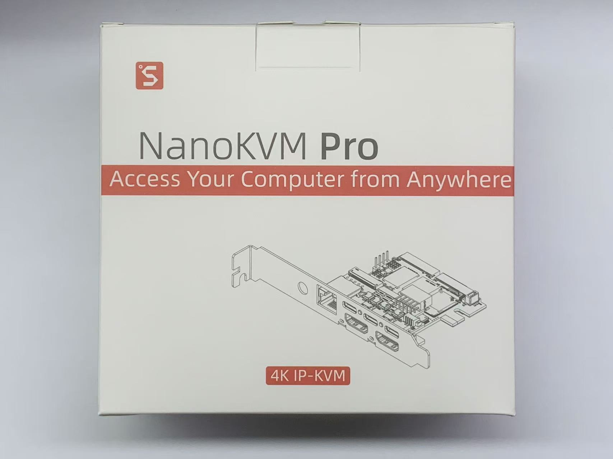
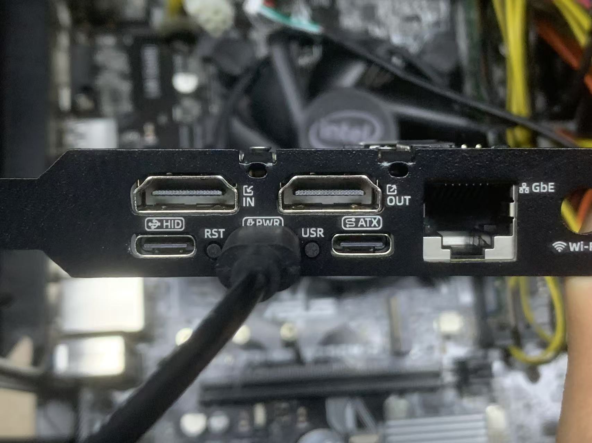
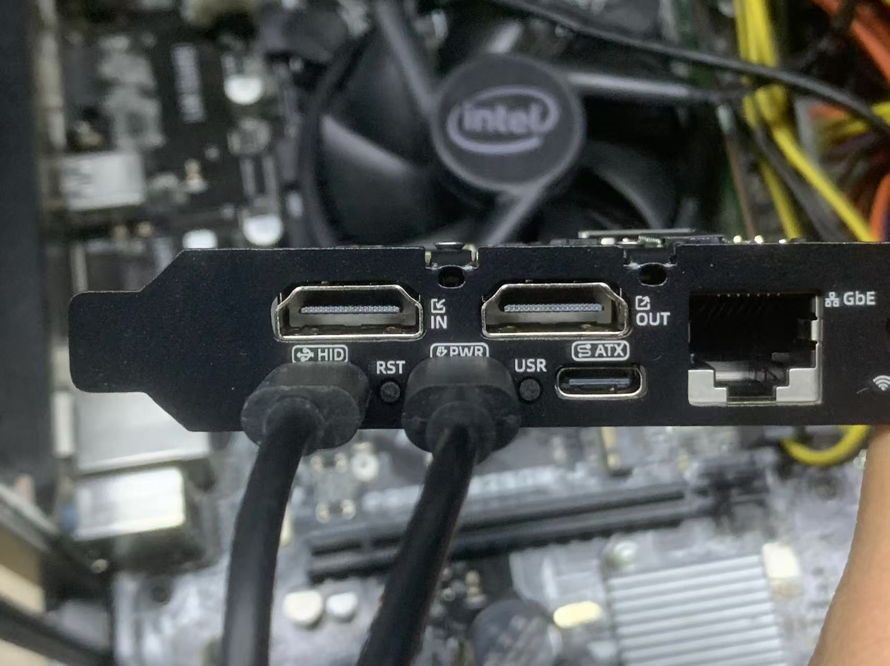
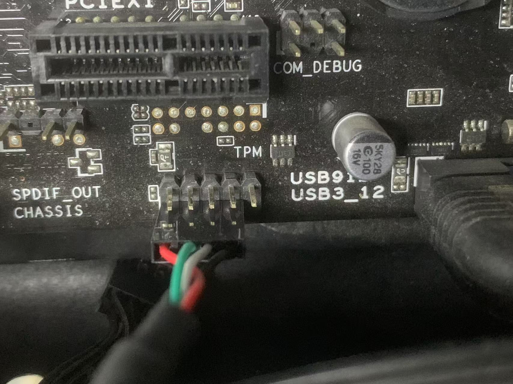
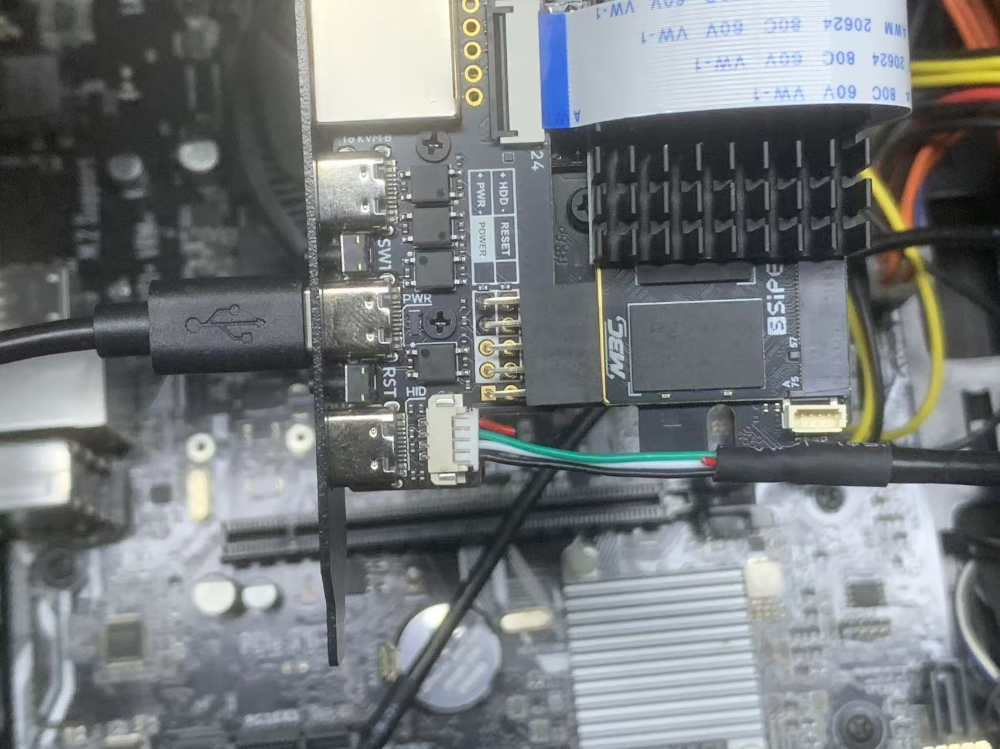

## 开箱

### NanoKVM-ATX 开箱清单

NanoKVM-ATX包含：
+ NanoKVM-ATX 主机配全高PCIe挡板+OLED *1；
+ HDMI 线缆 150cm *1；
+ HDMI 线缆 50cm *1；
+ USB TypeA to TypeC 100cm *2；
+ 4Pin 机箱内USB线 40cm *1；
+ ATX-9Pin 一分二开机线 30+30cm *1；
+ 小十字螺丝刀 *1；
+ 天线 *1（仅WiFi版）；

## 接口定义

## 接线

1. 连接电源，NanoKVM-Pro 对电源要求略高，部分主板的USB接口无法提供充足的电流，为保证 NanoKVM-Pro 正常工作，强烈建议外接5V1A及其以上的电源（实际运行功耗约3W）；

2. 连接USB-HID接口：
    + ATX版本：可以采用机箱内接线/外部C口接线两种方式

> 首批ATX版本用户若选择机箱内接线的方式，为防止主板9PinUSB供电不足导致的NanoKVM异常，建议剪断红色线头（仅由外部供电）再使用！

3. 使用网线连接路由器/交换机和NanoKVM-Pro，如果没有有线网络，可以跳过此步，开机后配置Wi-Fi使用（需要购买带有WiFi的版本）

4. 连接HDMI-IN，如果主板仅有一个视频接口且有外接屏幕的需求，请将HDMI-OUT连接至你的显示屏；

> 注意 NanoKVM-Pro 采集最大支持4K30FPS，内置的HDMI一分二会主动读取外接屏幕的分辨率和帧率，并向主机提供屏幕和采集端公共的模式列表，
>   如果你连接了一个4K60FPS的显示屏，电脑会识别为一个最高支持4K30的屏幕（被采集端限制，可以关闭采集，让4K60直出显示器）
>   如果你连接了一个1080P的显示屏，电脑会识别为一个最高1080P的屏幕（被环出显示器限制）
5. （非必须）连接ATX电源控制接口

## 内网访问

### 连接网络

1. 如果采用有线连接，上电后KVM将会获取一个由路由器DHCP分配的IP地址，可以跳过此步骤
2. WiFi连接
    + ATX版本可以通过OLED实现配网，步骤如下
        1. 连接NanoKVM-ATX的AP：长按USR按钮，KVM会释放一个WiFi信号（AP），OLED上显示此IP的信息，可以扫描二维码快速连接
        2. 登陆网页填写要连接的WiFi帐号密码：连接WiFi后OLED显示网页链接，可以手动输入网址或扫描二维码快速跳转到网页配网
3. 如果有需要也可以通过USB-NCM网络连接

### 访问页面

1. ATX版本：连接网络后OLED上显示本地IP地址（E IP是有线网络获取的IP；W IP是wifi网络获取的IP，默认自动切换显示）；
2. 同一内网环境下使用一台主机在浏览器（建议使用Chrome）上输入IP地址访问页面；

> 出现此警告是正常现象，NanoKVM-Pro开启了https来增强安全性，并使用自签名ssl证书
3. 初始默认帐号`admin`，密码`admin`可以登陆至系统内部，强烈建议您立即修改帐号密码；
4. 检查图像/键鼠/开关机按钮是否正常工作

## 远程连接

1. NanoKVM-Pro 默认安装了 Tailescale 应用，可以在网页设置中登陆你的 Tailscale 帐号。所有登陆 Tailscale 的设备会自动拉入同一虚拟的内网环境中，并给每一台设备分配`100.xxx.xxx.xxx`的IP，可以通过分配给 NanoKVM Pro 的 IP 远程访问并控制你的主机
2. 其他异地组网工具：NanoKVM-Pro 基于Ubuntu，可以通过`apt`安装应用，如zerotier，请按照官网提示安装相关应用