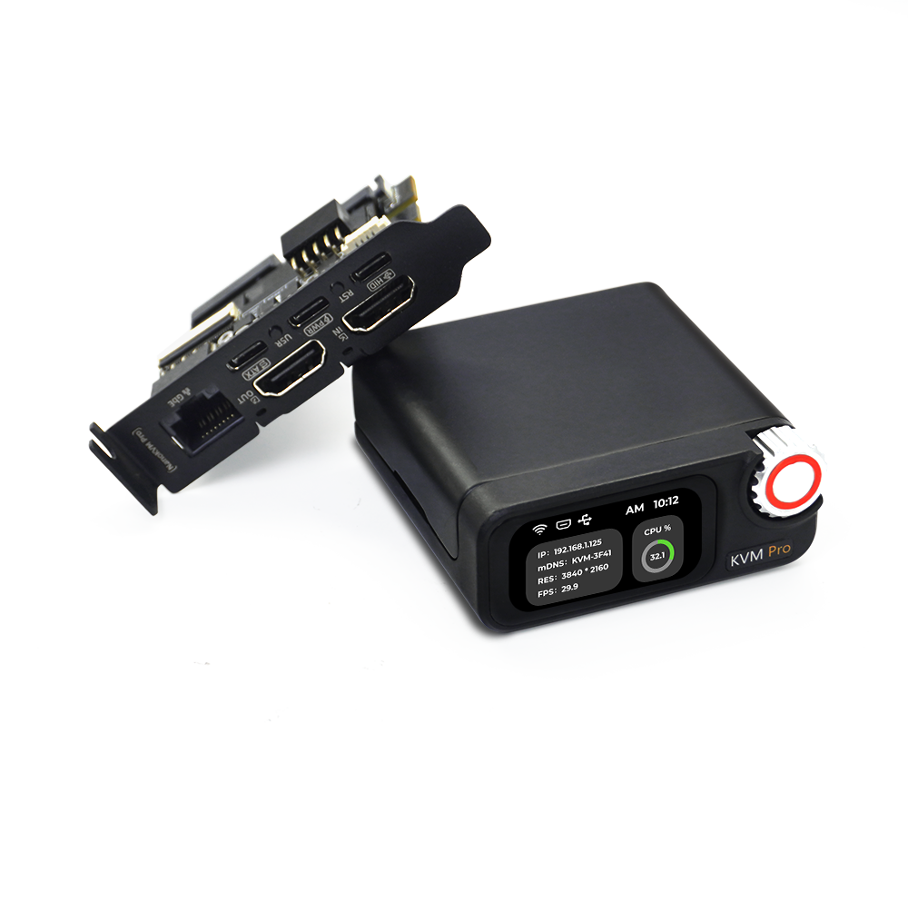

## 简介

NanoKVM Pro 是 NanoKVM 的延续，作为 IP-KVM 产品继承了 NanoKVM 系列的极致体积和强大扩展性，在性能上有了质的飞跃，更加适合远程办公场景。

为满足不同用户的需求，NanoKVM Pro 提供两种形态：NanoKVM-Desk 与 NanoKVM-ATX：

NanoKVM-Desk 意为桌面版NanoKVM Pro，主体采用阳极氧化的磨砂金属外壳，前面板使用1.47寸触摸屏显示KVM核心信息，并且可以方便设置硬件功能，或作为mini副屏使用，搭配左侧无极旋钮获得更有质感的使用体验。

NanoKVM-ATX 是NanoKVM Pro的机箱内版本，标配半高/全高挡板可安装在机箱内部，由于可以内置的USB线缆[3]和电源控制接口更方便主机用户安装。通过外部连接HDMI接口、网线和USB即可实现远程控制。

NanoKVM Pro 采用AX630作为主控核心，采用 ARM 1.2G 双核 A53 CPU；外置 1GB LPDDR4 内存为远程桌面连接提供强有力的计算支持。内置HDMI环出+采集芯片，最高提供4K60FPS的HDMI环出和4K45FPS视频采集[1]。得益于AX630高效且强大的图像处理架构，NanoKVM-Pro可以以极低的延迟传输高分辨率画面，2K画面下典型延迟低至60ms[2]。

IP-KVM系列产品是远程桌面的硬件外挂，通过HDMI捕捉画面，通过网络实时同步画面与键鼠操作，最后模拟键鼠完成对电脑的控制。由于该方式整个流程不需要主机软件，完全由外部硬件实现，因此NanoKVM可以实现对主机的BIOS级别控制，尤其在远程开关机、多系统切换、BIOS配置、远程装机等场景下有广泛的应用空间。

由于升级后的的强大性能，NanoKVM Pro 不仅为临时维护提供可靠支持，由于其低延迟高分辨率特性，还能在远程办公领域大展身手。后期我们将对 NanoKVM Pro 的软件进行持续升级，带来更方便的自动化/MCP功能和更广泛的兼容性。

为满足用户不同需求，NanoKVM Pro 提供 WiFi、PoE、屏幕边缘同步灯带等可选项，相关配置和价格请以购买页面为准。

## 参数

| 产品        | NomoKVM-Pro    | NomoKVM      | GxoKVM      | JxxKVM      |
|-------------|----------------|--------------|-------------|-------------|
| 主控        | AX630C         | SG2002       | RV1126      | RV1106      |
| 核心        | 2xA53@1.2G     | 1xC906@1.0G  | 4xA7@1.5G   | 1xA7@1.2G    |
| 内存        | 1G LPDDR4X     | 256M DDR3    | 1G DDR3     | 256M DDR3   |
| 硬盘        | 32G eMMC       | 32G microSD  | 8G eMMC     | 16G eMMC    |
| 系统        | NomoKVM+PIKVM  | NomoKVM      | GxoKVM      | JxxKVM      |
| 分辨率      | 4K@45fps, 2K@95fps[4] | 1080P@60fps | 4K@30fps, 2K@60fps | 1080P@60fps |
| HDMI环出    | 4k环出         | ×            | ×           | ×           |
| 视频编码    | MJPG/H264/H265[5] | MJPG/H264    | MJPG/H264   | MJPG/H264   |
| 音频传输    | √              | ×            | √           | ×           |
| UEFI/BIOS支持 | √             | √            | √           | √           |
| 模拟USB键盘鼠标 | √          | √            | √           | √           |
| 模拟USB ISO | √              | √            | √           | √           |
| IPMI        | √              | √            | √           | ×           |
| 网络唤醒(WOL) | √             | √            | √           | √           |
| WebSSH      | √              | √            | √           | √           |
| 自定义脚本  | √              | √            | ×           | ×           |
| 串行终端    | 2通道          | 2通道        | 无          | 1通道       |
| 存储性能    | 32G eMMC 300MB/s | 32G MicroSD 12MB/s | 8G eMMC 120MB/s | 8G eMMC 60MB/s |
| 以太网      | 1000M          | 100M         | 1000M       | 100M        |
| 机箱内形态   | 可选 ATX版本    | 可选 PCIe版本 | ×           | ×           |
| WiFi        | 可选WiFi6      | 可选WiFi6    | ×           | ×           |
| ATX电源控制 | √              | √            | +15$     | +10$     |
| 显示屏      | 1.47英寸 320x172 LCD 0.96英寸 128x64 OLED | 0.96英寸 128x64 OLED | 无 | 1.66英寸 280x240 |
| 更多功能    | 同步LED灯效, 智能助手 | –        | –           | –           |
| 功耗        | 0.6A@5V        | 0.2A@5V      | 0.4A@5V     | 0.2A@5V     |
| 电源输入    | USB-C/PoE     | USB-C/PoE/PCIe | USB-C       | USB-C       |
| 尺寸        | 65x65x28mm     | 40x36x36mm   | 80x60x7.5mm | 60x6x24-30mm |

## NanoKVM-PCIe 资料

+ [NanoKVM Pro 镜像下载 (待更新)](https://github.com/sipeed/NanoKVM-Pro/releases/latest)
+ [ATX上手指南](https://wiki.sipeed.com/hardware/zh/kvm/NanoKVM_Pro/atx_start.html)
+ [高级应用](https://wiki.sipeed.com/hardware/zh/kvm/NanoKVM_Pro/extended.html)
+ [常见问题](https://wiki.sipeed.com/hardware/zh/kvm/NanoKVM_Pro/faq.html)

## 购买入口

[预售页面](https://sipeed.com/nanokvm/pro)
[淘宝官方购买地址 (待更新)]() 
[速卖通购买地址 (待更新)]()

## 产品反馈

如果您在使用过程中有任何问题或建议，请通过以下渠道和我们反馈：

+ [Github issues](https://github.com/sipeed/NanoKVM-Pro/issues)
+ [MaixHub 论坛](https://maixhub.com/discussion/nanokvm)
+ QQ 交流群: 703230713

> [1] 在仅环出场景下可以单独关闭采集功能来直接环出4K60的画面；环出+采集同时运行时可以达到4K30FPS；
> [2] 延迟可能会受到网络带宽和网络节点等原因有所差异，实测数据来源于Sipeed实验室；
> [3] USB-HID接口可以机箱内部接线，也可以外部连接，二选一即可；
> [4] 由于4K45FPS非标准下的模式，出厂默认采用4K30+2K60，后续更新解锁4K45FPS/2K95FPS/1080P144FPS的方法；
> [5] 目前出厂支持H264/MJPEG模式，后续更新将提供H265支持；
